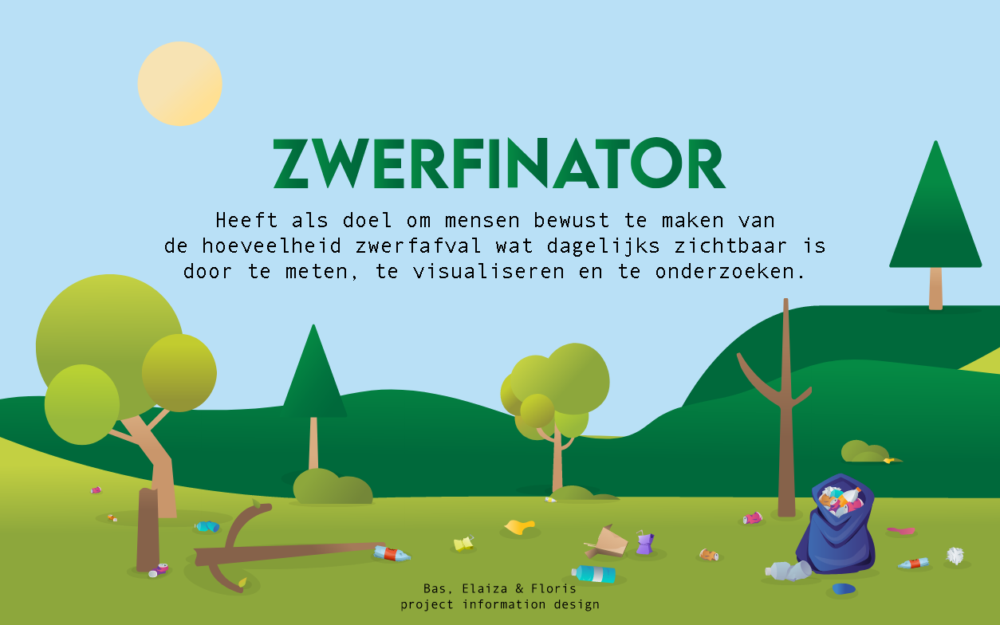

### Project Information Design | Zwerfinator

#### Zwerfinator Scrollytelling


### Link naar de app
[Live preview](https://basv1996.github.io/zwerfinator/)


## Opdracht
Zwerfinator houdt zich bezig met het bestrijden van zwerfafval en plastic vervuiling aan de hand van 
data. Door van elk stuk opgeraapt zwerfafval een foto te maken en daar later een aantal datatags toe 
te voegen wordt er data verzameld waarmee de problematiek op meerdere manieren kan worden 
aangepakt.  


## Table of Contents
  * [Opdracht](#assessment)
  * [📋 Concept](#---concept)
  * [⚙️ Installatie](#---installation)
  * [🗃 Data](#---data)
  * [ℹ️ Resources](#---resources)
  * [🗺️ License](#----license)


## 📋 Concept

Als idee heb ik met mijn team gekozen om het verhaal van Dirk, aka de Zwerfinator, te gaan vertellen aan de hand van een scrollytelling. Hiermee willen wij het verhaal van Dirk op een leuke en educatieve manier overbrengen en hiermee mensen aansporen dat zijn werkwijze helpt. 


## ⚙️ Installatie
### clone deze repo
Om deze app te installeren kan je de repository clonen:
```bash
git clone https://github.com/basv1996/zwerfinator.git
```

### Navigaar naar de hoofdmap
```bash
cd zwerfinator

```

### Run de applicatie
```bash
npm start

```
## 🗃 Data
Welke data heb ike gebruikt?

Ik heb de data verkregen van Dirk gebruikt. Dirk heeft enorm veel data opgestuurd naar alle teams. Wij hebben ervoor gekozen om met de data van de drankverpakkingen aan de slag te gaan. Door deze data Heeft Dirk het voor elkaar gekrgen bij rijkswaterstaat om statiegeld op kleinere plastic drankflessen te


### Credits
- Dirk Groot, aka zwerfinator
- All the coaches of project Information Design
- My team members for this project 


## 🗺️ License
Author: [Bas Vugts](https://github.com/basv1996) , license by
[MIT](https://github.com/basv1996/zwerfinator/blob/master/LICENSE)      
[](https://opensource.org/licenses/MIT)


